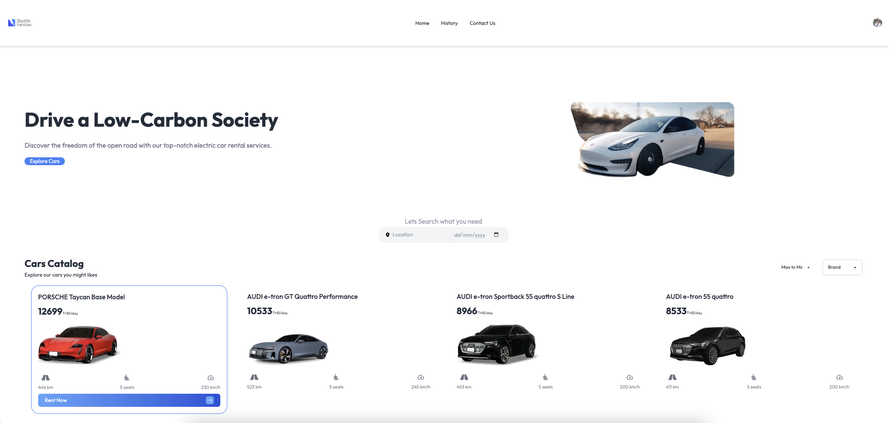
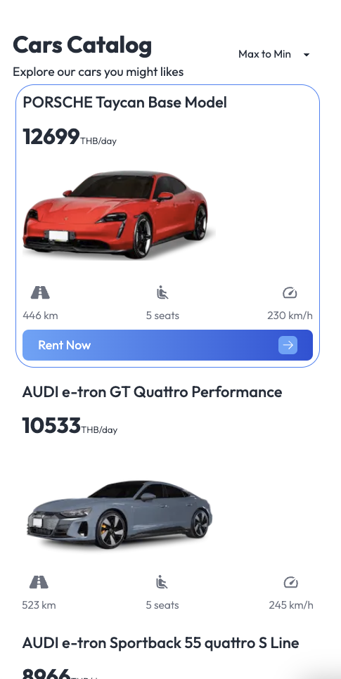
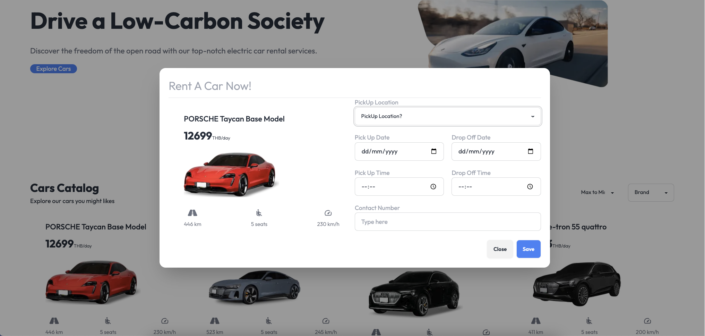

# Car Rental Application
## Overview

This is a car rental application built with React, Next.js, and Tailwind CSS. It includes features such as a responsive navigation bar, car listing with booking functionality, and a context-based notification system.




## Features

- **Responsive Navigation Bar**: Includes links to Home, History, and Contact Us, along with user authentication.

- **Car Listing**: Displays available cars with options to filter by brand and price.
- **Booking Modal**: Allows users to book a selected car.

- **Skeleton Loading**: Shows skeleton loaders while car data is being fetched.
- **Search Functionality**: Includes a search input for filtering cars by location and date.

## Components

### `NavBar`

A responsive navigation bar with logo, navigation links, and user authentication button.

**Props:**
- None

### `CarCard`

Displays information about a car, including name, price, image, and specifications.

**Props:**
- `car`: Object containing car details.

### `CarCardSkelton`

Skeleton loader for the `CarCard` component, shown while car data is loading.

**Props:**
- None

### `BookingModal`

A modal for booking a car, displaying car details and a booking form.

**Props:**
- `selectedCar`: Object containing details of the selected car.

### `Form`

Form within the booking modal for selecting pickup location, dates, times, and contact details.

**Props:**
- `car`: Object containing car details.

### `SearchInput`

Search bar for filtering cars by location and date.

**Props:**
- None

### `CarsList`

Displays a list of cars with the option to select and book a car.

**Props:**
- `carsList`: Array of car objects.

### `CarsFiltersOption`

Allows filtering cars by brand and price.

**Props:**
- `carsList`: Array of car objects.
- `setBrand`: Function to set the selected brand.
- `setPrice`: Function to set the price filter.

### `ToastMsg`

Displays a toast notification.

**Props:**
- `msg`: Message to be displayed in the toast.

### `BookCreatedFlagContext`

Context for managing booking creation status and toast notifications.

## Installation

1. **Clone the Repository**

    ```bash
    git clone git@github.com:prechak/Car-Rental-Project.git
    cd Car-Rental-Project
    ```

2. **Install Dependencies**

    ```bash
    npm install
    ```

3. **Run the Application**

    ```bash
    npm run dev
    ```

4. **Open the Application**

    Visit `http://localhost:3000` in your browser.

## Usage

1. **Navigation**: Use the `NavBar` component for navigation between Home, History, and Contact Us.

2. **Car Listings**: Browse available cars, view details, and book cars using the `CarsList` and `CarCard` components.

3. **Search**: Use the `SearchInput` component to filter cars by location and date.

4. **Booking**: Open the `BookingModal` to book a car. Fill in the form and submit your booking.

5. **Notifications**: The `ToastMsg` component displays notifications based on the `BookCreatedFlagContext` state.

## Contributing

If you would like to contribute to this project, please fork the repository and submit a pull request with your changes. Ensure that your code adheres to the project's coding standards and includes tests where applicable.

## License

This project is licensed under the MIT License - see the [LICENSE](LICENSE) file for details.

## Acknowledgements

- **React**: A JavaScript library for building user interfaces.
- **Next.js**: A React framework for server-side rendering.
- **Tailwind CSS**: A utility-first CSS framework for rapid UI development.
- **Clerk**: For user authentication.

